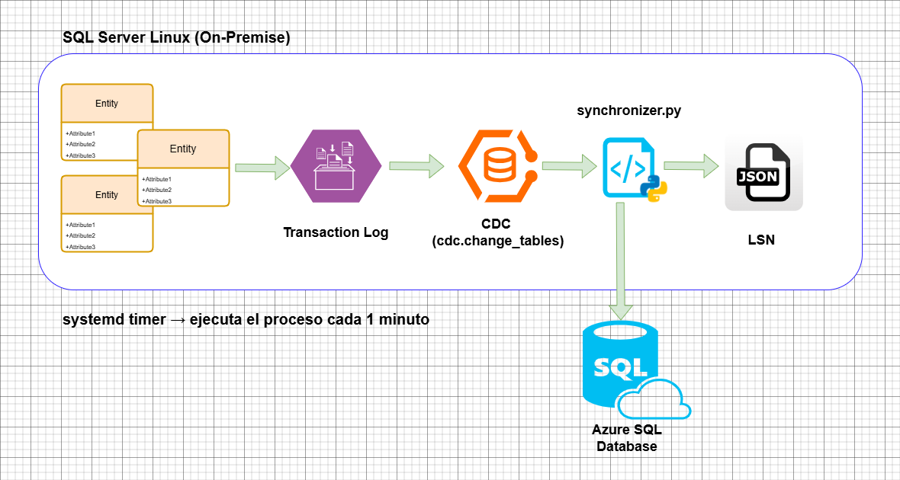

# onprem-to-azure-cdc

Sistema de replicación near real-time desde SQL Server on-premise hacia Azure SQL Database usando CDC (Change Data Capture) y Python.

---

## Descripción

Este proyecto implementa un pipeline de sincronización de datos que captura cambios en tablas de SQL Server on-premise y los replica automáticamente en Azure SQL Database. Utiliza CDC para detectar INSERT, UPDATE y DELETE sin depender de columnas de timestamp ni modificaciones al esquema existente.

El sistema corre como un servicio de Linux administrado por `systemd`, ejecutándose cada minuto de forma autónoma.

---

## Diagrama de flujo


---

## Stack tecnológico

| Componente | Tecnología |
|---|---|
| Base de datos origen | SQL Server 2025 on Linux |
| Base de datos destino | Azure SQL Database |
| Captura de cambios | SQL Server CDC (Change Data Capture) |
| Lenguaje | Python 3 |
| Orquestación | systemd timer |
| Pruebas | pytest + pytest-mock |
| Gestión de entorno | python-dotenv |

---

## Estructura del proyecto

```
onprem-to-azure-cdc/
├── main.py                  → Punto de entrada
├── synchronizer.py          → Lógica principal de sincronización
├── db_connections.py        → Gestión de conexiones
├── watermark_manager.py     → Control del LSN por tabla
├── cdc_utils.py             → Utilidades CDC
├── logger.py                → Logs con rotación automática
├── watermark.json           → Estado de LSN (generado en runtime)
├── .env                     → Variables de entorno
└── tests/
    ├── test_cdc_utils.py
    ├── test_watermark_manager.py
    └── test_synchronizer.py
└── config_systemd/
    ├── cdc_homecenter.timer
    └──  cdc_homecenter.service
```

---

## Requisitos

- SQL Server 2017+ en Linux con SQL Server Agent habilitado
- Python 3.8+
- Azure SQL Database activa y accesible por el servidor on-premise
- Puerto 1433 saliente habilitado en el servidor on-premise

### Dependencias Python

```bash
pip install pymssql python-dotenv pytest pytest-mock --break-system-packages
```

---

## Configuración

### 1. Variables de entorno

Crea un archivo `.env` basado en `.env.example`:

```env
# SQL Server Local
LOCAL_SERVER=localhost
LOCAL_USER=tu_usuario
LOCAL_PASSWORD=tu_password
LOCAL_DATABASE=tu_base_de_datos

# Azure SQL Database
AZURE_SERVER=tu-servidor.database.windows.net
AZURE_USER=tu_usuario_azure
AZURE_PASSWORD=tu_password_azure
AZURE_DATABASE=tu_base_de_datos_azure

# Esquema de las tablas
DB_SCHEMA=dbo
```

Asegura los permisos del archivo:

```bash
chmod 600 .env
```

### 2. Habilitar SQL Server Agent

```bash
sudo /opt/mssql/bin/mssql-conf set sqlagent.enabled true
sudo systemctl restart mssql-server
```

### 3. Habilitar CDC en la base de datos

```sql
USE TuBaseDeDatos;
EXEC sys.sp_cdc_enable_db;
```

### 4. Crear usuario dedicado para el sincronizador

```sql
USE master;
CREATE LOGIN cdc_sync_user WITH PASSWORD = 'TuPassword';

USE TuBaseDeDatos;
CREATE USER cdc_sync_user FOR LOGIN cdc_sync_user;
EXEC sp_addrolemember 'db_datareader', 'cdc_sync_user';
GRANT SELECT ON SCHEMA::cdc TO cdc_sync_user;
```

### 5. Habilitar CDC por tabla

```sql
USE TuBaseDeDatos;

EXEC sys.sp_cdc_enable_table
    @source_schema        = N'dbo',
    @source_name          = N'nombre_tabla',
    @role_name            = NULL,
    @supports_net_changes = 1;
```

Verifica las tablas activas:

```sql
SELECT
    object_schema_name(source_object_id) AS source_schema,
    object_name(source_object_id)        AS source_table,
    capture_instance
FROM cdc.change_tables
```

---

## Cómo agregar nuevas tablas

1. Habilitar CDC en la tabla deseada (ver paso 5 de configuración)
2. Verificar que la tabla existe en Azure SQL Database con el mismo esquema
3. El sincronizador la detecta automáticamente en el próximo ciclo, no requiere cambios en el código

Para deshabilitar una tabla:

```sql
EXEC sys.sp_cdc_disable_table
    @source_schema    = N'dbo',
    @source_name      = N'nombre_tabla',
    @capture_instance = N'dbo_nombre_tabla';
```

---

## Cómo funciona CDC

CDC no usa timestamps ni columnas especiales. Lee directamente el **transaction log** de SQL Server y registra cada cambio en tablas internas (`cdc.dbo_tabla_CT`) con la siguiente estructura:

| Columna | Descripción |
|---|---|
| `__$operation` | 1=DELETE, 2=INSERT, 3=BEFORE_UPDATE, 4=AFTER_UPDATE |
| `__$start_lsn` | LSN (Log Sequence Number) de la transacción |
| `__$update_mask` | Bitmask de columnas modificadas |
| Columnas de la tabla | Valores al momento del cambio |

El sincronizador usa el LSN como **watermark** para saber desde qué punto leer en cada ciclo. Este valor se persiste en `watermark.json` por cada tabla activa.

---

## Ejecución manual

```bash
python3 main.py
```

---

## Pruebas

```bash
cd /ruta/del/proyecto
pytest tests/ -v
```

Las pruebas usan mocks para las conexiones a base de datos, no requieren conectividad real.

---

## Configuración del servicio systemd

Copia y edita los archivos de servicio remplazando los datos necesarios y ajustando el timer al tiempo deseasdo (deafult 1s):

```bash
sudo cp onprem-to-azure-cdc/config_systemd/cdc_homecenter.service /etc/systemd/system/
sudo cp onprem-to-azure-cdc/config_systemd/cdc_homecenter.timer   /etc/systemd/system/
```

Activa e inicia:

```bash
sudo systemctl daemon-reload
sudo systemctl enable cdc_homecenter.timer
sudo systemctl start cdc_homecenter.timer
```

Verificar estado:

```bash
sudo systemctl status cdc_homecenter.timer
```

Ver logs en tiempo real:

```bash
journalctl -fu cdc_homecenter.service
```

Detener temporalmente:

```bash
sudo systemctl stop cdc_homecenter.timer
```

Deshabilitar permanentemente:

```bash
sudo systemctl disable cdc_homecenter.timer
sudo systemctl stop cdc_homecenter.timer
```

---

## Logs

El sistema genera logs diarios con rotación automática en `/ruta/del/proyecto/logs/`:

- Tamaño máximo por archivo: **5MB**
- Archivos de respaldo: **7**
- Formato: `YYYY-MM-DD.log`

Cada ciclo de sincronización registra:
- Inicio y fin del ciclo con duración total
- Tablas activas detectadas en CDC
- Cambios procesados por tabla con tipo de operación
- Tablas exitosas, sin cambios, fallidas o inexistentes en Azure
- Duración de sincronización por tabla

Ejemplo de log:

```
2026-03-12 20:40:17 | INFO | synchronizer | ============================================================
2026-03-12 20:40:17 | INFO | synchronizer | INICIO DE CICLO | 2026-03-12 20:40:17
2026-03-12 20:40:17 | INFO | synchronizer | ESQUEMA         | dbo
2026-03-12 20:40:17 | INFO | synchronizer | ============================================================
2026-03-12 20:40:17 | INFO | cdc_utils    | 2 tabla(s) activas en CDC: ['families', 'categories']
2026-03-12 20:40:18 | INFO | synchronizer | families | 2 cambio(s) encontrado(s)
2026-03-12 20:40:18 | INFO | synchronizer | families | ✅ Completada en 1.10s
2026-03-12 20:40:19 | INFO | synchronizer | ============================================================
2026-03-12 20:40:19 | INFO | synchronizer | RESUMEN DEL CICLO | Duración total: 2.19s
2026-03-12 20:40:19 | INFO | synchronizer |   ✅ Exitosas    : ['families', 'categories']
2026-03-12 20:40:19 | INFO | synchronizer |   ⏭️  Sin cambios : []
2026-03-12 20:40:19 | INFO | synchronizer |   ❌ Fallidas    : []
2026-03-12 20:40:19 | INFO | synchronizer |   ⚠️  No en Azure : []
2026-03-12 20:40:19 | INFO | synchronizer | ============================================================
```

---

## Consideraciones de seguridad

- El archivo `.env` nunca debe incluirse en el repositorio (está en `.gitignore`)
- El usuario de base de datos tiene permisos mínimos: solo lectura y acceso al esquema CDC
- El servidor on-premise no expone ningún puerto entrante, todas las conexiones son salientes hacia Azure

---

## Limitaciones conocidas

- El sincronizador asume que **la primera columna de cada tabla es la PK**
- Las tablas deben existir en Azure con el mismo nombre y esquema antes de iniciar la sincronización
- CDC requiere que el SQL Server Agent esté activo en el servidor on-premise
- Latencia mínima de sincronización: **1 minuto** (determinada por el timer de systemd)
